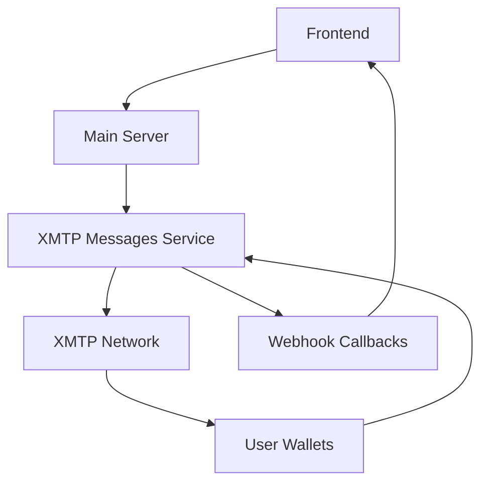

# XMTP Messages Microservice

A Node.js microservice for receiving and broadcasting messages using the XMTP (Extensible Message Transport Protocol) messaging system. This service integrates with the x402-gateway streaming application to provide Web3 messaging capabilities.

## Features

- **XMTP Client Integration**: Full XMTP protocol support for messaging
- **Message Broadcasting**: Send messages to multiple recipients simultaneously
- **Real-time Message Listening**: Stream incoming messages with webhook support
- **RESTful API**: Complete HTTP API for all messaging operations
- **Security**: Rate limiting, CORS, and Helmet security middleware
- **Docker Support**: Ready-to-deploy containerized service
- **Health Monitoring**: Built-in health checks and status endpoints

## API Endpoints

### Core Messaging

- `POST /api/messages/initialize` - Initialize XMTP client with private key
- `POST /api/messages/send` - Send message to single address
- `POST /api/messages/broadcast` - Broadcast message to multiple addresses
- `POST /api/messages/listen/start` - Start listening for incoming messages
- `POST /api/messages/listen/stop` - Stop message listening

### Conversation Management

- `GET /api/messages/conversations` - Get all conversations
- `GET /api/messages/messages/:peerAddress` - Get messages from specific conversation
- `POST /api/messages/conversation` - Create new conversation
- `GET /api/messages/address` - Get client address
- `GET /api/messages/can-message/:address` - Check if address can receive messages

### Status & Health

- `GET /api/messages/status` - Get client status
- `GET /api/messages/health` - Health check endpoint
- `GET /health` - Service health check

## Setup & Installation

### Prerequisites

- Node.js 18+ 
- Ethereum wallet with private key
- Docker (for containerized deployment)

### Environment Variables

Create a `.env` file in the messages directory:

```env
# Required
NODE_ENV=production
PORT=3001
XMTP_ENVIRONMENT=production

# Optional
ALLOWED_ORIGINS=http://localhost:3000,http://localhost:8000
WEBHOOK_URL=https://your-webhook-endpoint.com
```

### Local Development

1. Install dependencies:
```bash
cd messages
npm install
```

2. Create environment file:
```bash
cp .env.example .env
```

3. Start development server:
```bash
npm run dev
```

### Docker Deployment

1. Build the image:
```bash
docker build -t x402-gateway/xmtp-messages:latest ./messages
```

2. Run with docker-compose:
```bash
docker-compose up -d xmtp-messages
```

## Usage Examples

### Initialize XMTP Client

```bash
curl -X POST http://localhost:3001/api/messages/initialize \
  -H "Content-Type: application/json" \
  -d '{
    "privateKey": "your_ethereum_private_key_here",
    "options": {
      "appName": "x402-gateway",
      "appVersion": "1.0.0"
    }
  }'
```

### Send Message

```bash
curl -X POST http://localhost:3001/api/messages/send \
  -H "Content-Type: application/json" \
  -d '{
    "peerAddress": "0x1234567890123456789012345678901234567890",
    "content": "Hello from x402-gateway!",
    "messageType": "text"
  }'
```

### Broadcast Message

```bash
curl -X POST http://localhost:3001/api/messages/broadcast \
  -H "Content-Type: application/json" \
  -d '{
    "addresses": [
      "0x1234567890123456789012345678901234567890",
      "0x0987654321098765432109876543210987654321"
    ],
    "content": "Broadcast message from x402-gateway",
    "messageType": "text"
  }'
```

### Start Message Listening

```bash
curl -X POST http://localhost:3001/api/messages/listen/start \
  -H "Content-Type: application/json" \
  -d '{
    "webhookUrl": "https://your-app.com/webhook/xmtp"
  }'
```

## Message Types

The service supports different message types:

- `text` - Plain text messages
- `emoji` - Emoji messages  
- `image` - Image messages
- `file` - File attachments
- `system` - System notifications

## Integration with x402-gateway

This microservice is designed to work seamlessly with the x402-gateway streaming application. The main server can communicate with this service to:

1. Send notifications to users via XMTP
2. Broadcast system updates
3. Handle user-to-user messaging
4. Provide real-time message streaming

### Communication Flow



## Security Considerations

- **Private Key Security**: Never expose private keys in logs or error messages
- **Rate Limiting**: 100 requests per 15 minutes per IP
- **CORS**: Configurable origins for cross-origin requests
- **Helmet**: Security headers for HTTP protection
- **Environment Variables**: Sensitive data stored in environment

## Monitoring

### Health Checks

- Service health: `GET /health`
- XMTP connection health: `GET /api/messages/health`
- Client status: `GET /api/messages/status`

### Logging

Logs are written to:
- Console (development)
- `/logs/combined.log` (all logs)
- `/logs/error.log` (errors only)

### Metrics

Monitor these key metrics:
- Message send success rate
- Broadcast completion time
- Active conversation count
- Client initialization status

## Troubleshooting

### Common Issues

1. **Client Not Initialized**
   - Ensure private key is valid
   - Check network connectivity
   - Verify XMTP environment settings

2. **Message Send Failures**
   - Verify recipient address format
   - Check if recipient can receive messages
   - Ensure sufficient gas for transactions

3. **Listening Issues**
   - Confirm client is initialized before starting
   - Check webhook URL accessibility
   - Monitor connection stability

### Debug Mode

Set `NODE_ENV=development` for detailed logging and error messages.

## Development

### Project Structure

```
messages/
├── src/
│   ├── index.js              # Main server entry point
│   ├── xmtp-handler.js       # XMTP client wrapper
│   └── routes/
│       └── messageRoutes.js   # API route handlers
├── package.json               # Dependencies and scripts
├── Dockerfile              # Container configuration
└── README.md              # This file
```

### Adding New Features

1. **New Message Types**: Extend `MessageType` in `xmtp-handler.js`
2. **API Endpoints**: Add routes in `messageRoutes.js`
3. **Middleware**: Add security/validation in `index.js`
4. **Tests**: Create test files in `test/` directory

## Contributing

1. Fork the repository
2. Create feature branch
3. Add tests for new functionality
4. Ensure all tests pass
5. Submit pull request

## License

MIT License - see LICENSE file for details.

## Support

For issues and questions:
1. Check the troubleshooting section
2. Review logs for error details
3. Create issue with detailed description
4. Include environment and configuration details